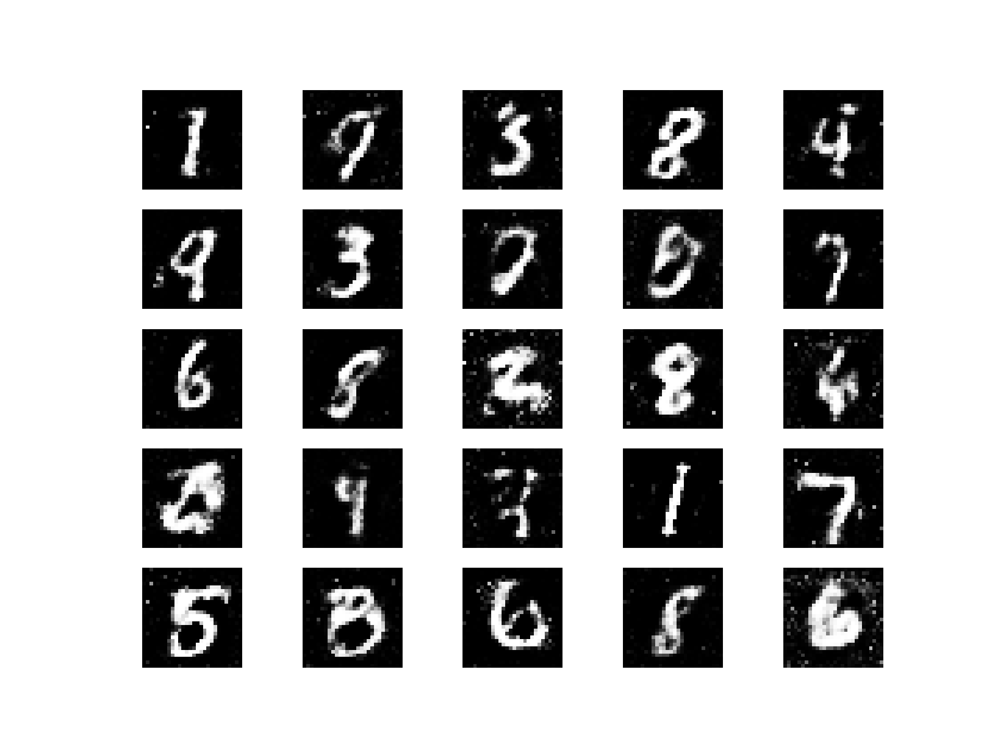

# MNIST GAN – Generate Handwritten Digits with Keras

This project implements a basic Generative Adversarial Network (GAN) using the MNIST dataset. The GAN is trained to generate realistic handwritten digits from random noise using Keras and TensorFlow.

## 🔍 Overview

- Dataset: MNIST (28x28 grayscale digits)
- Framework: Keras with TensorFlow backend
- Output: Generated digit images from noise
- Training Epochs: 10,000

## 📸 Sample Output (Epoch 10,000)

Below is a sample grid of digits generated by the GAN after 10,000 training epochs:

## 📦 Requirements

- tensorflow
- keras
- numpy
- matplotlib

(Include these in a `requirements.txt` file)
